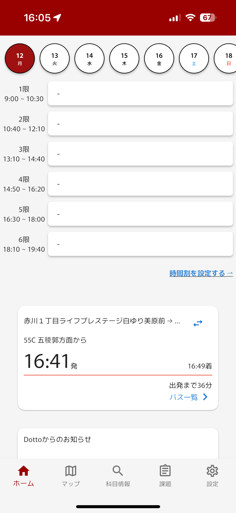
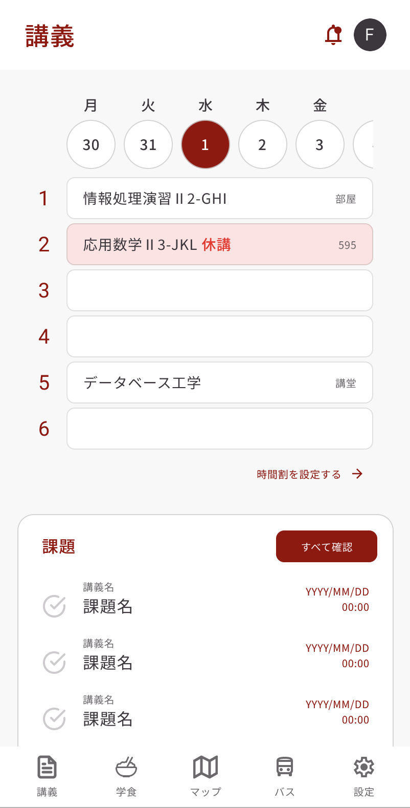
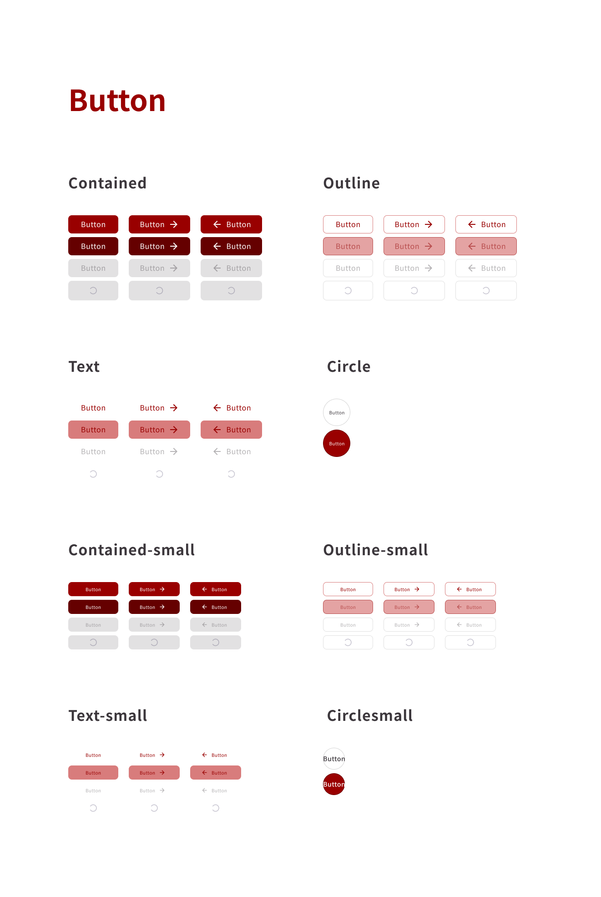
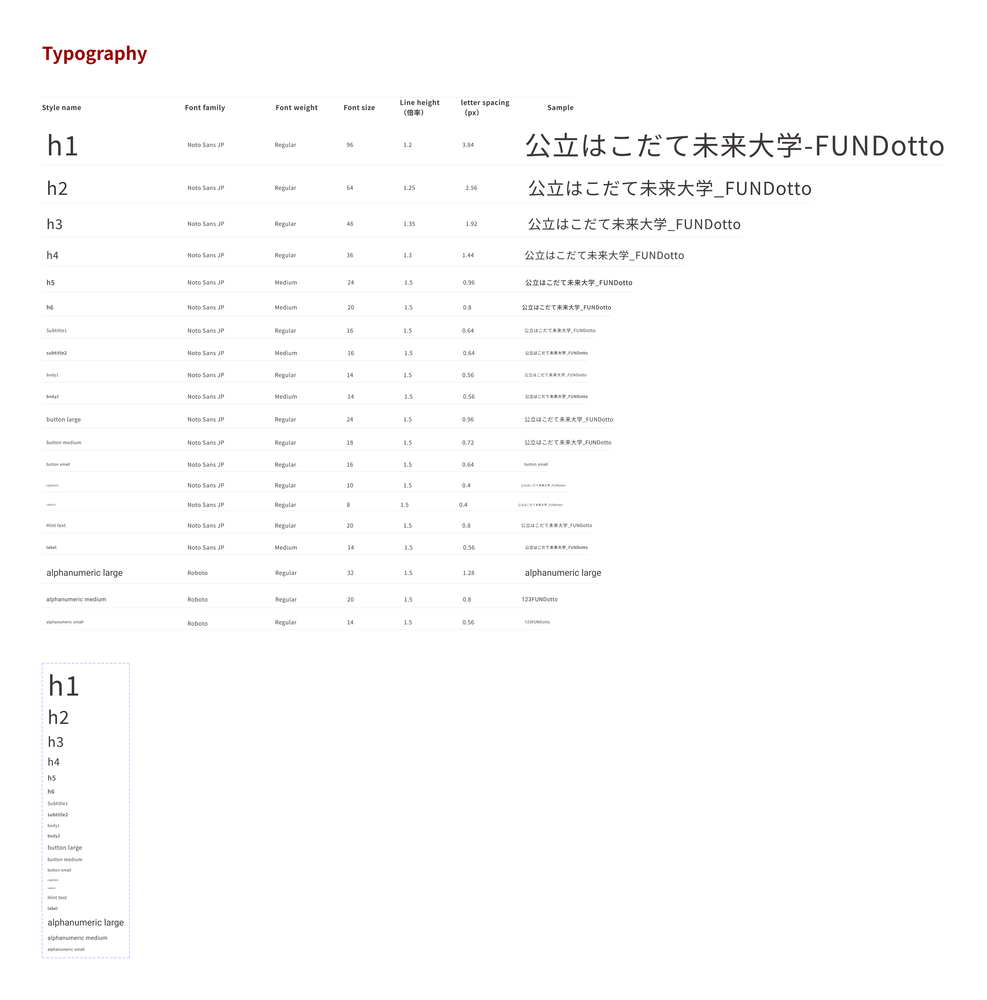

# Dotto デザインシステム

## デザインシステムの目的

Dotto アプリの継続的な改善や機能追加を、より効率的かつ安定的に進めるために、開発とデザインの共通基盤としてデザインシステムを構築しました。
共通コンポーネントやスタイルを事前に整備することで、デザインや実装にかかる工数を抑えつつ、色・文字・レイアウトの統一を図り、一貫性のある UI を実現します。また、複数人による長期的な開発体制でも、誰が関わっても意図を保った画面設計が可能になります。

## 背景と課題

これまでの Dotto の UI は、枠線やシャドウの有無・サイズなどがページごとに異なり、「なんとなく」の判断でデザイン・実装が進められていました。また、色や装飾に明確な意味付けがされておらず、大人数で開発を行う際には一貫したユーザー体験の提供が難しい状況でした。

## デザインシステムの構成

- スタイルとレイアウト
  - セマンティックカラーによる色設計（エクスペンシブカラー/セマンティックカラー：success, warning, error）
  - 見出し/subtitle・本文/body・注釈/caption など明確に定義されたタイポグラフィの定義
- コンポーネント
  - ボタン、リスト、チェックボックスなど、現在使用中のコンポーネントを優先して制作
  - ホバー時やアクティブ時、Disable 時、など細かい動きに合わせた、実装時にエンジニアじんじんバリアントを管理できるように
  - アイコンの有無など用途に合わせて微調整ができるように定義した

## 既存デザインとの違い

- Before（v1）
  - 枠線や影の使い方にバラつき
  - 色の意味が統一されていない
  - テキストサイズや余白の揺れ
- After (v2)
  - 各コンテンツ要素の見た目に統一感が生まれた
  - コンポーネントの再利用により、開発効率が向上
  - 文字サイズや色に意味を持たせて設計することで、強調すべき情報と補足情報のコントラストが明確に

## 参考画像

