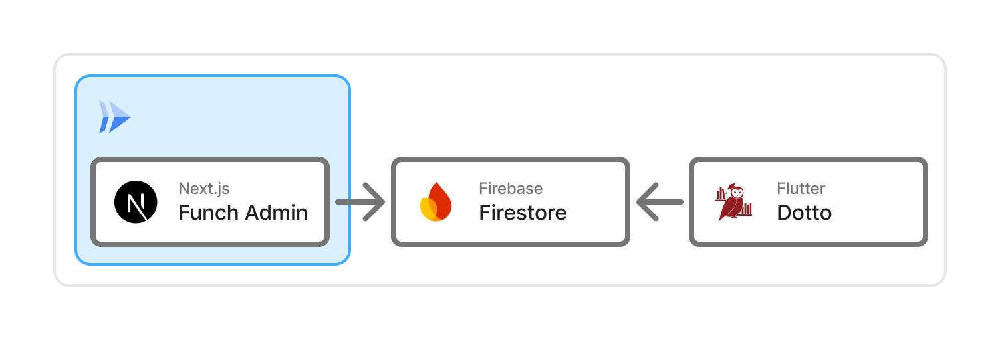

# Funch - 学食メニュー管理システム

## システム概要

Funch は、学生が学食メニューを簡単に閲覧できるシステムです。スマートフォンからいつでも最新のメニュー情報を確認でき、快適な学食利用をサポートします。

## 背景・課題

現状では、以下の課題がありました：

### 学生側の課題

- 学食メニューを簡単に確認できない
- 従来の PDF 公開形式では見にくく、日々のメニュー確認が困難
- スマートフォンでの閲覧性が悪い

### 大学生協側の課題

- エクセルでメニューを作成して PDF で公開する作業が面倒
- データの管理・更新が非効率的

そこで、学生がより手軽に学食メニューを閲覧でき、かつ生協職員の作業負担も軽減できるシステムとして、Funch を開発しました。

## Funch の解決策

### システム構成

Funch は以下の 3 つのコンポーネントで構成されています：

#### 1. Funch Admin（管理者用 Web アプリ）

- **対象ユーザー**: 大学生協の方
- **主な機能**:
  - **月ごとメニュー管理**: その月毎日提供される固定メニューの設定
  - **日ごとメニュー管理**: その日に提供されるメニューの設定
  - **メニュー種別**: 月・日それぞれ以下のメニューを管理できる
    - 共通メニュー: 大学生協共通のメニュー
    - オリジナルメニュー: 未来大オリジナルメニュー

#### 2. Funch-Dotto（学生向け表示機能）

- **対象ユーザー**: 学生
- **主な機能**:
  - 当日から 1 週間後までのメニュー表示
  - レギュラーメニュー（毎日提供される・その月固定のメニュー）の表示

### データフロー

学食メニューが学生に表示されるまでの流れ

1. 大学生協の方がFunch Adminでメニューを入力
2. メニューデータがFirebaseに保存される
3. Funch-DottoがFirebaseからデータを取得
4. 学生のアプリ画面にメニューが表示される

**詳細な処理フロー**:

1. **メニュー登録**: 生協職員が Admin 画面で月次・日次メニューを登録
2. **データ保存**: 入力されたメニュー情報が Firestore/Storage に自動保存
3. **リアルタイム同期**: Firebase のリアルタイム DB でデータが即座に同期
4. **学生表示**: Dotto アプリが最新のメニューデータを自動取得・表示

## 技術スタック

### フロントエンド

- **Next.js 15.3.5** (React 18.3.1, TypeScript 5.5.3)
- **Tailwind CSS 3.4.10** - スタイリング
- **shadcn/ui** - モダンな UI コンポーネントライブラリ
- **@dnd-kit/core 6.1.0** - ドラッグ&ドロップ
- **@radix-ui** - UI コンポーネント
- **lucide-react 0.525.0** - アイコンライブラリ
- **react-icons 5.3.0** - アイコンライブラリ

### バックエンド

- **Firebase 11.2.0**
  - Firestore (データベース)
  - Firebase Auth (認証)
  - Firebase Storage (画像)

### インフラ・デプロイ

- **Google Cloud Run** - コンテナデプロイ
- **Docker** - コンテナ化

### アーキテクチャパターン

- **Clean Architecture**
  - UI Layer (React コンポーネント)
  - Presenter Layer (状態管理)
  - Service Layer (ビジネスロジック)
  - Repository Layer (データアクセス)
