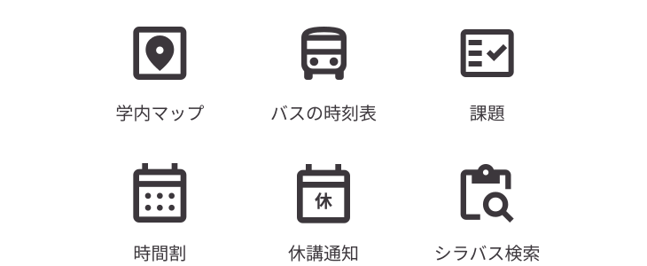

<Header subtitle="Dottoについて">Dottoとは</Header>

- 公立はこだて未来大学の学生が情報を  
  わかりやすく簡単に手に入れることができる
  - 学内のさまざまなプラットフォームに  
    散らばる情報
  - 友達・先輩からしか得られない情報

<!--
公立はこだて未来大学の学生が、学内のLMS (HOPE) 、教務システムを始めとしたさまざまなプラットフォームに散らばる情報や、友達や先輩とのつながりがなければ知ることのできない情報をわかりやすく簡単に把握することができるアプリである。
-->

---

<Header subtitle="Dottoについて">技術スタック・ツール</Header>

- Flutter, Riverpod
- Next.js
- Google Cloud Platform, Firebase
- GitHub, GitHub Projects, GitHub Actions
- Figma
- Discord

<!--

-->
