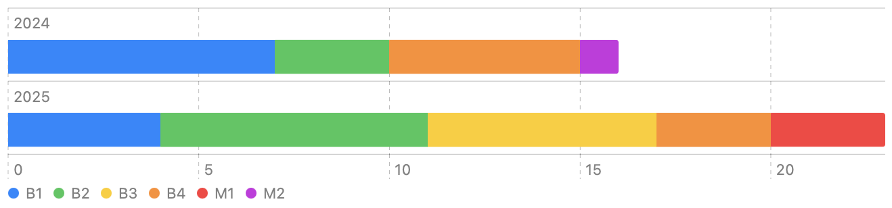
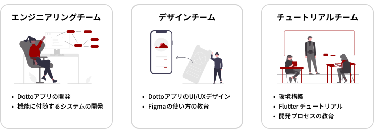

<Header subtitle="今年度の開発体制">メンバー構成</Header>

- 昨年度メンバーである卒業者3名以外の13名は継続
- 新メンバー10名を迎え、計23名
- 全メンバーがプロジェクトリーダーと 1 on 1
  - 各自の興味・関心、開発経験、プロジェクトで調整したいことをヒアリング

<!--

-->

---

<Header subtitle="今年度の開発体制">チーム体制</Header>

<!--

-->
