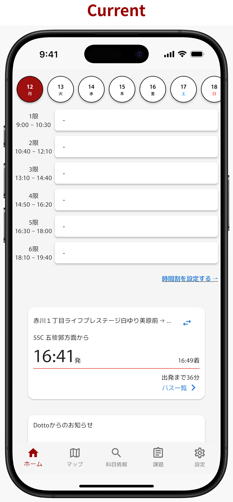
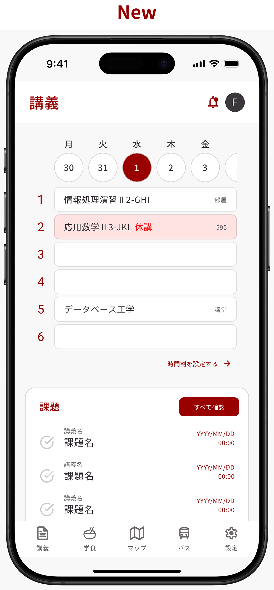

<Header subtitle="今期の活動">CI/CD</Header>

### CI

- ソースコードの品質保持
- `flutter_test` によるテスト
- Coverageの向上を目指す

<!--
ユニットテストケースが存在しなかったため、コードの品質を保証できなかった。GitHub Actions による CI ワークフローを構築し、 flutter_test を用いたテストケースを実装することで、コード品質を保証できる環境を整えた。今後、テストカバレッジの向上に向け、テストケースの実装を進めていく。
-->

---

<Header subtitle="今期の活動">CI/CD</Header>

### CD

- fastlane
  - 証明書管理 (iOS)
  - アプリアーカイブと配信を自動化
- GitHub Actionsを用いたCDワークフローの構築を目指す

<!--
リリース前にテスト環境へのデプロイを手動で行っていた。GitHub Actions による CD ワークフローの構築に向け、 fastlane を用いた証明書管理やアプリアーカイブのアップロード配信の自動化を行なった。
-->

---

<Header subtitle="今期の活動">Funch</Header>

### 機能とシステムの概要

- 生協食堂のメニューをDottoアプリから確認できる機能
- 生協担当者がシステムにメニューを登録するためのWebアプリ **Funch Admin**

<!--
学食のメニューを把握するのが難しいという課題があった。生協の担当者がシステムにメニューを登録するWebアプリ “Funch Admin” とそのメニューを Dotto アプリから閲覧できるシステムを実装した。2025年後期のリリースを予定している。
-->

---

<Header subtitle="今期の活動">デザインシステム</Header>

### ねらい

- デザイン・実装ともに工数を抑える
- 一貫したUI/UXを保つ
- 効率的・安定的な新機能追加

### デザインシステムの構成

- カラー・タイポグラフィなどのスタイル
- ボタンなどのコンポーネント
- コンポーネントを増やしていく

<!--

-->

---

<Header subtitle="今期の活動">デザインシステム</Header>

### 新規UIのプロトタイプ

新たに構築したデザインシステムを基盤としたUI

  
  

<!--

-->
